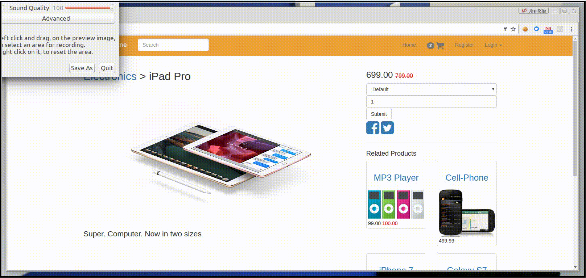

# Amazon Clone

AmazonClone is modeled of Amazon (www.amazon.com) E-commerce website. 

Languages & Frameworks: Django, JS/jQuery, HTML/CSS

## Key Features
1. Checkout Flow


2. Cart Page


## Setup & Run
1. Open the project directory and go to 'src' folder
```
cd src
```

2. Create virtual environment.
```
virtualenv . 
```

3. Activate virtual environment
source bin/activate 

4. Install the requirements for the project
pip install -r requirements.txt

5. run Django server
python manage.py runserver 

6. Open your browser and go to URL 'localhost:8000'

7. To deactivate the virtual environment, enter 'deactivate' on terminal
```
deactivate 
```

#### Study Source
Udemy - Django for Entrepreneur
Udacity - Full Stack Web Dev
